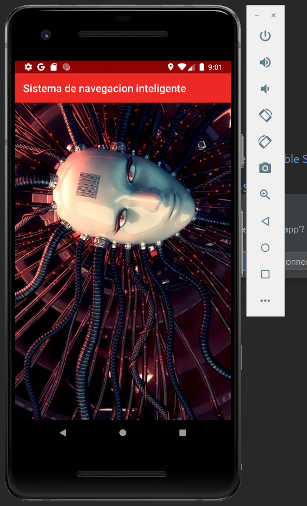
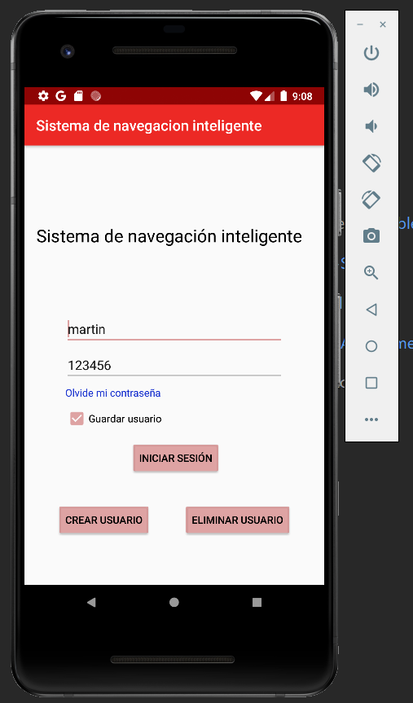
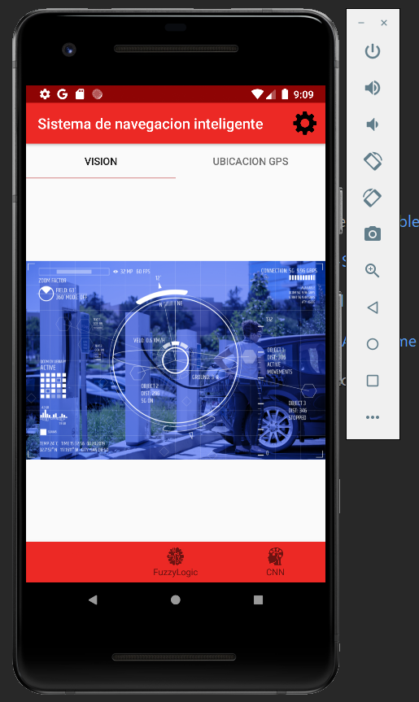
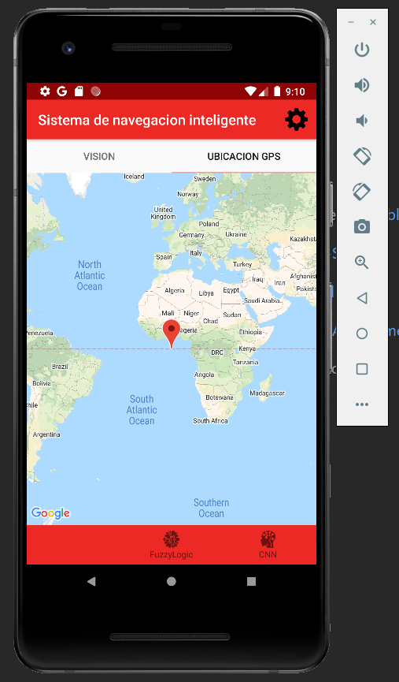
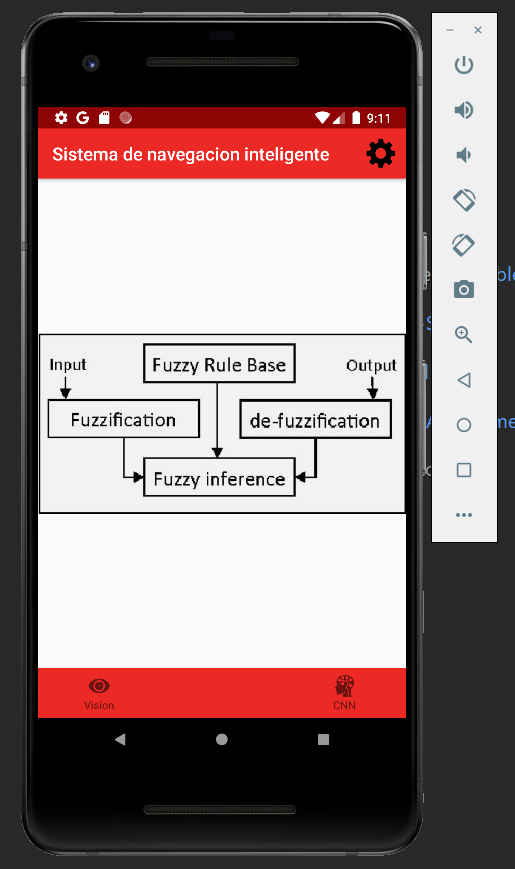
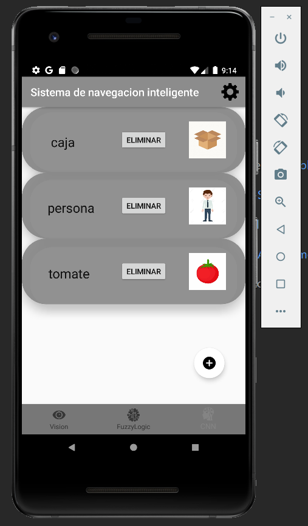
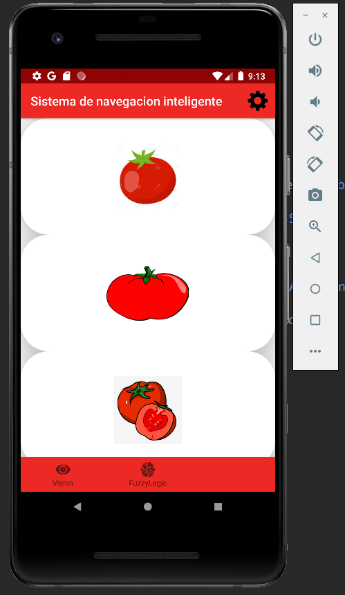
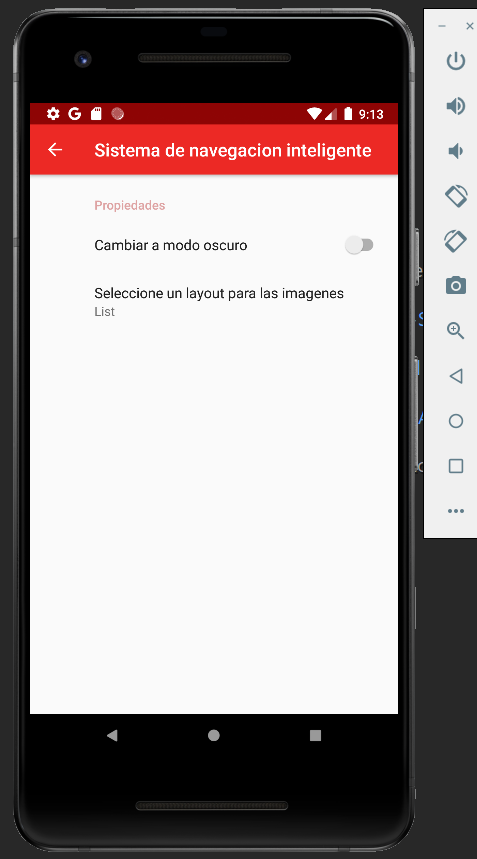

# Introduccion

El proposito del diseno de esta apliacion es darle una interfaz al usuario para permitirle interactuar con el robot desde el telefono celular. 

# Caracteristicas de esta version

* Minimo registro de usuario, inicio de sesion, cracion de usuario utilizando base de datos en la nube, la capacidad de eliminar el usuario creado, la posibilidad de utilizar un modo nocturno, etc.
* Una primera ventana tiene una solapa de "vision" en la cual en el futuro se visualizara lo que el robot visualiza con su camara. Una solapa llamada "gps" en la que en el futuro se tendra la ubicacion del robot en tiempo real.
* Ademas tiene una ventana en donde se visualizaran las reglas difusas utilizandas en cada momento.
* Y una ultima ventana en donde tiene un grilla de objetos/obstaculos reconocidos por el robot.   

## Fotos

    
    
    
     
    
    
    
    

