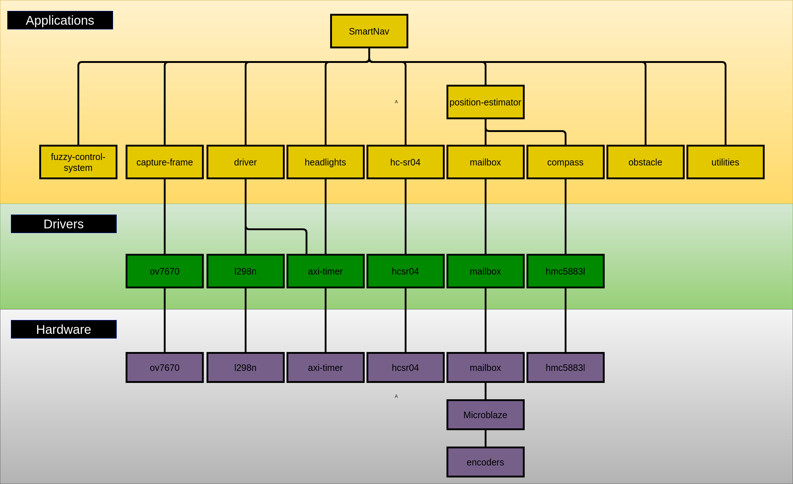
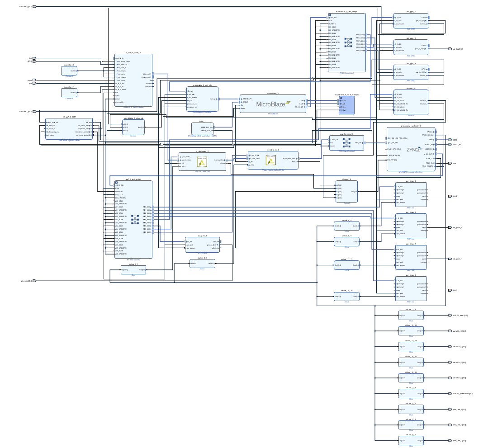
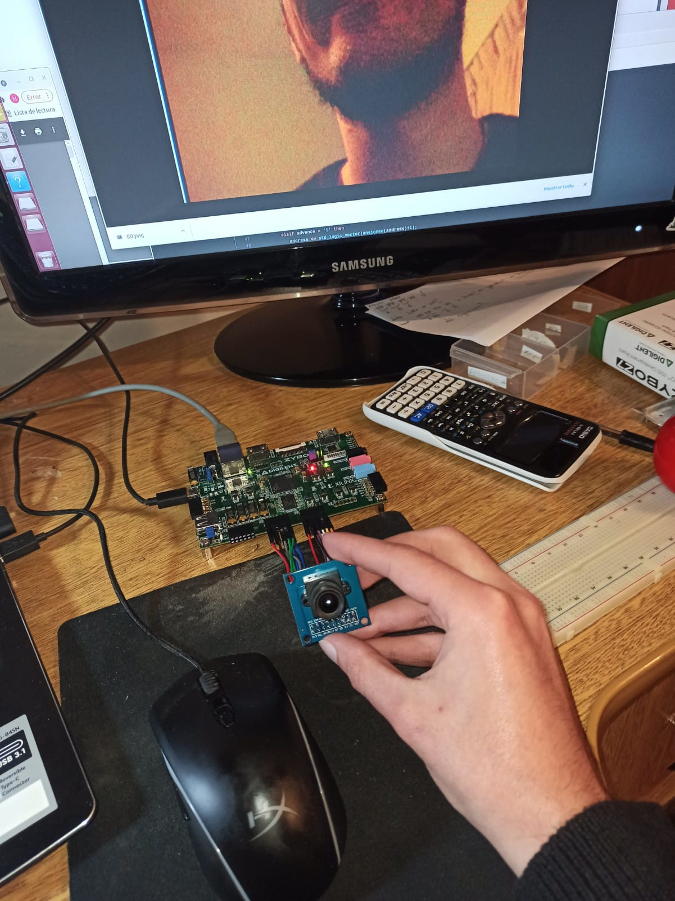
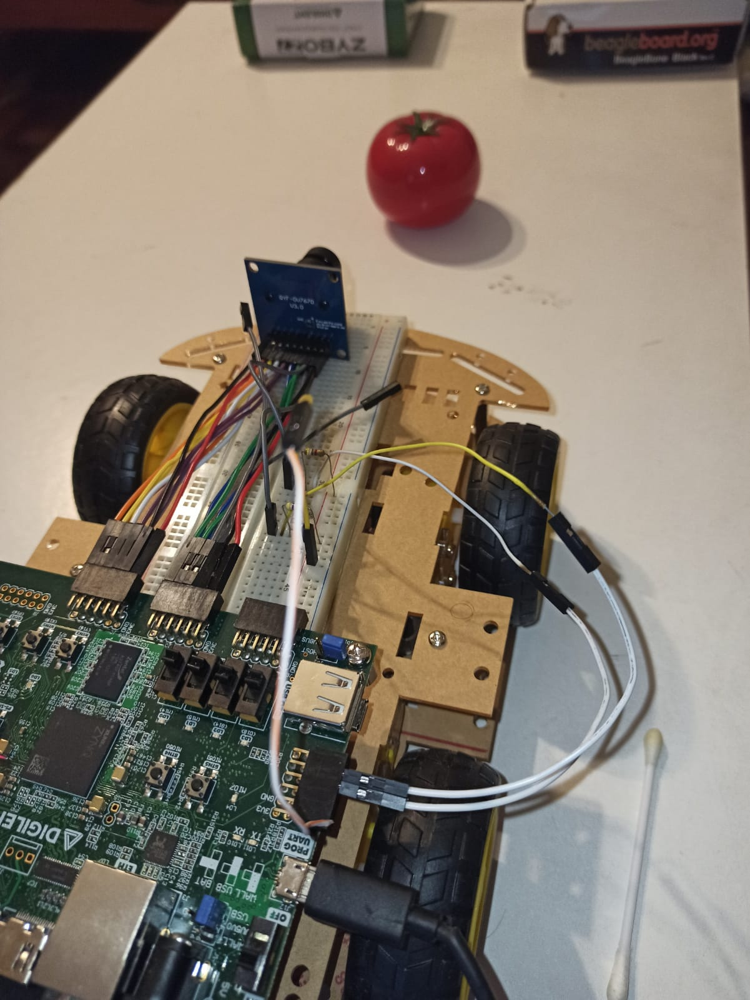
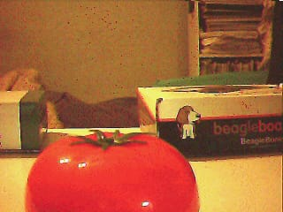
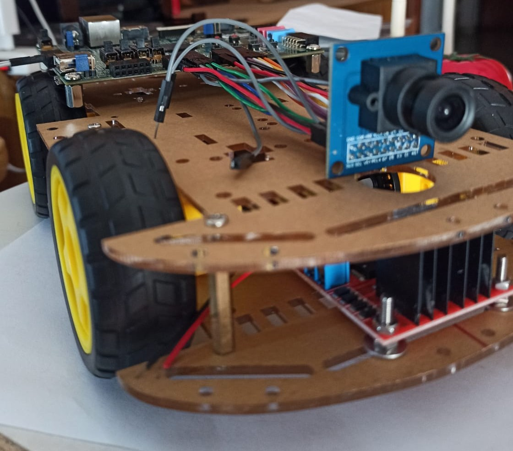
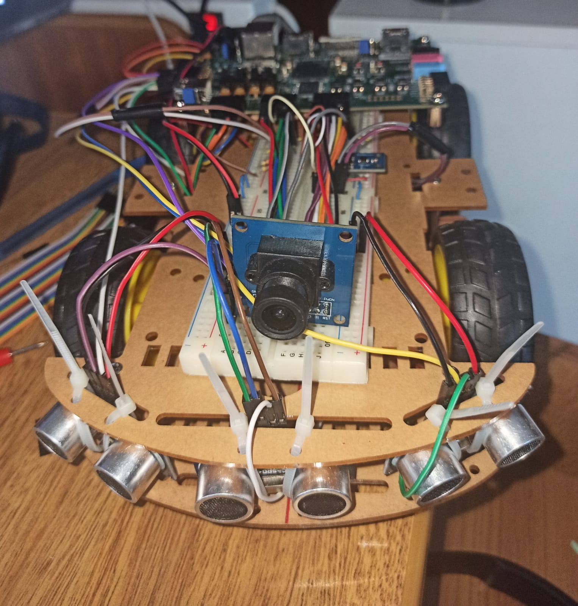

# Smartnav-platform

This is the platform of the smartnav project.

# Architecture 

# HDF 

Hardware description software

# Pictures

    
    
    
     
    
    
    
    
    
    

# Docker: How to use platform

./run-container.sh ./smartscout/

# Docker: How to use vivado

./run-container.sh ./smartscout-vivado/smartnav-vivado