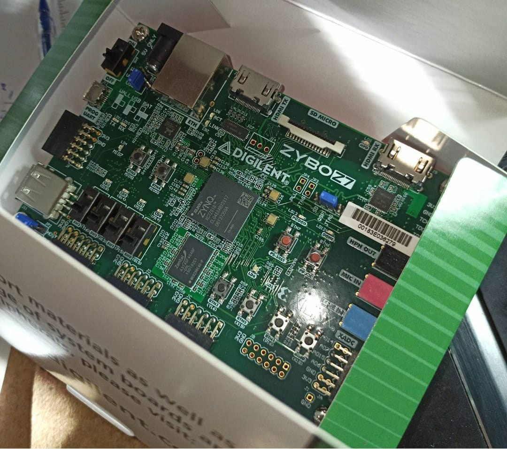
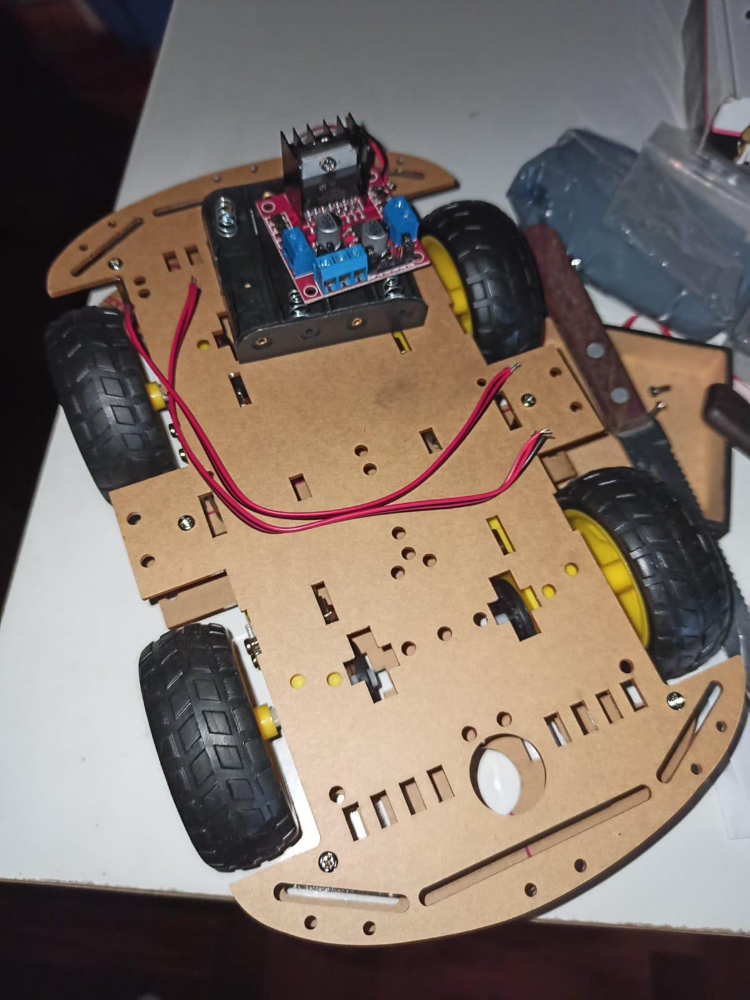
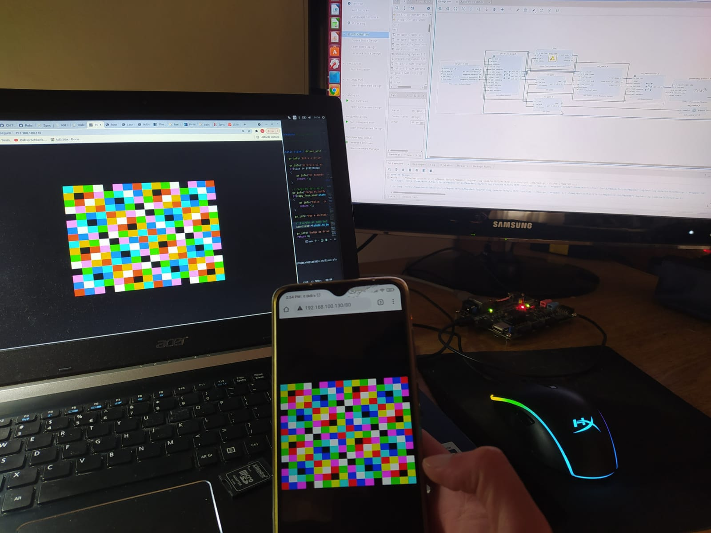
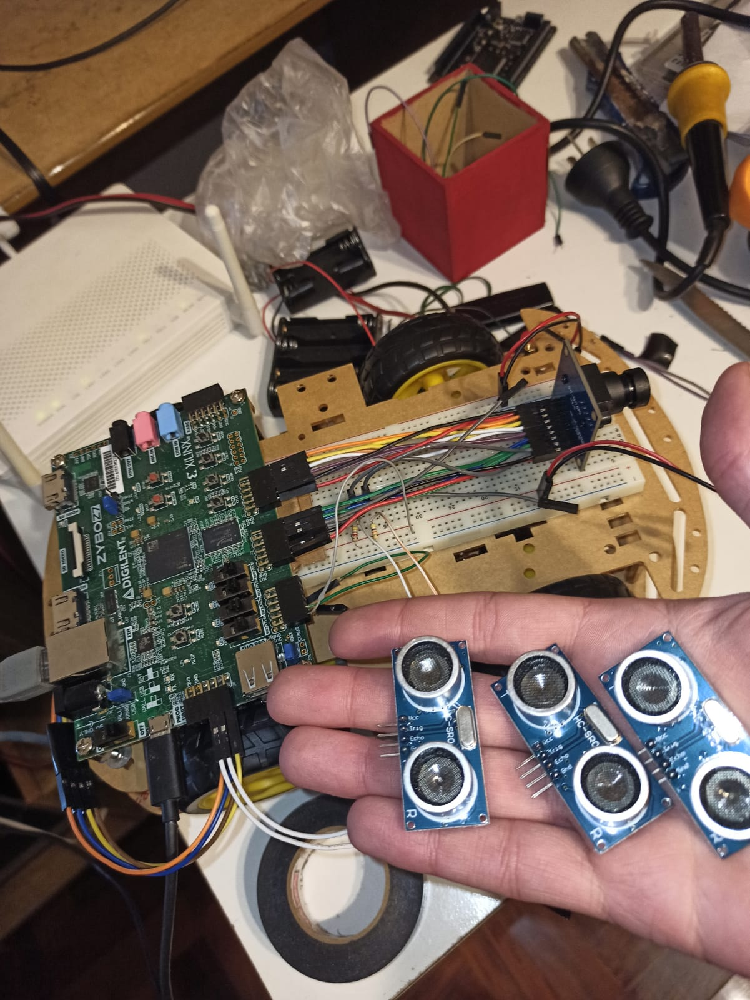

# Smartnav-platform

This is the platform of the smartnav project.

# Architecture 


# HDF 

Hardware description software


# Pictures

<p float="left">
    
    
    
     
    
    
    
    
    
    
</p>

# Docker: 

From the root of this repository:

+ Running Vivado: 
  ```
  sh run_vivado.sh
  ```
+ Basic build process (check Petalinux Documentation): 
  ```
  sh run_build.sh
  ```
+ Fully build process: 
  ```
  sh run_build_from_scratch.sh
  ```
+ Any command: 
  ```
  ./etc/petalin.sh "cd ./smartscout/smartscout-platform && petalinux-create -t apps --template install -n smartnav-app-init --enable"
  ```

# Acknowledgment

The base docker image was taken from this site: https://github.com/carlesfernandez/docker-petalinux (MIT LICENSE). I am fully grateful.