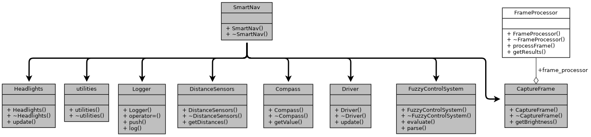
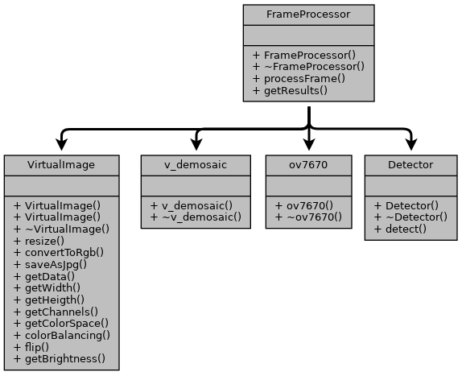
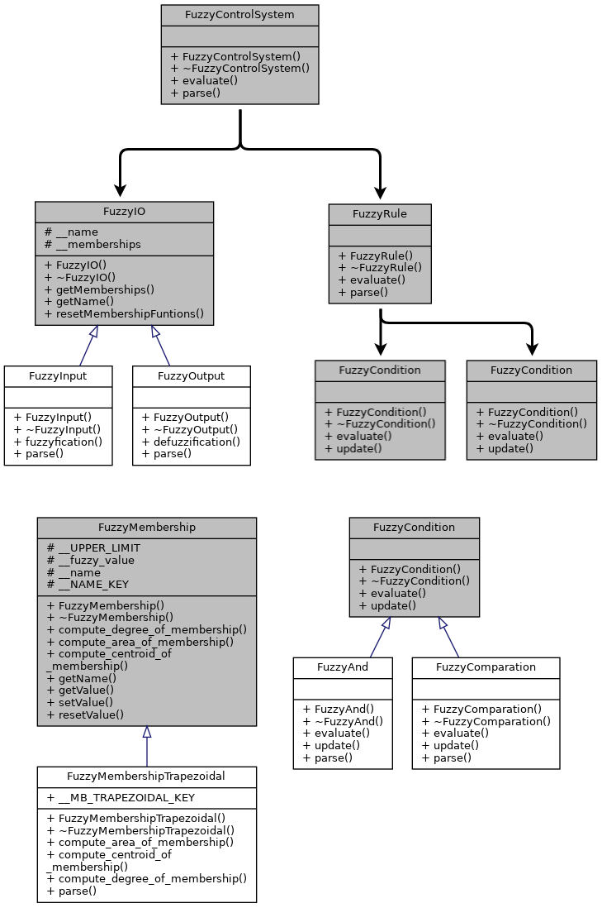

# smartnav-lib

The smartNavLib is a library to create a robot as intelligent as possible. It repo cantains a PetaLinux user library based on this project: https://github.com/kuhiu/SmartNavSysAccelByHW.

# Dependencies

  * petalinux 2019.1
  * tensorflow lite v2.3.0
  * nlohmann json
  * opencv (provided by petalinux)

NOTE: The entire project was developed on a development board Zybo Z7-10 built around the Xilinx Zynq-7000 family.

# Architecture 

The core of the project is the SmarNav object. 

  

* headlights: This module updates the brightness level of the car headlights. 
* utilities: This module wrapp multiples utilities of the project.
* logger: It logs all messages from the car control at runtime. Its thread safe. (unsupported for the current version of the compiler)
* DistanceSensors: Take multiples samples from the distance sensors and they are postprocessed by a Simple Moving Average filter.
* Compass: Take multiples samples from the compass and they are postprocessed by a Simple Moving Average filter. (reading is thread safe).
* Driver: This module let you driver the car with the current yaw and the speed variation you wanna set.
* FuzzyControlSystem: The fuzzy control system. It is a rule chain that you can set from a json file to control the car. Here decisions like how much to accelerate or where to go are made.
* CaptureFrame: It wrapps the ov7670 module (v4l2 app) to control the camera and the v_demosaic module (v4l2 app too) to control the conversion of the raw pixels to rgb pixels. It has the detector module to post process each frame using Tensorflow lite, too. 

# FrameProcessor 

  

# FuzzyControlSystem 

  

